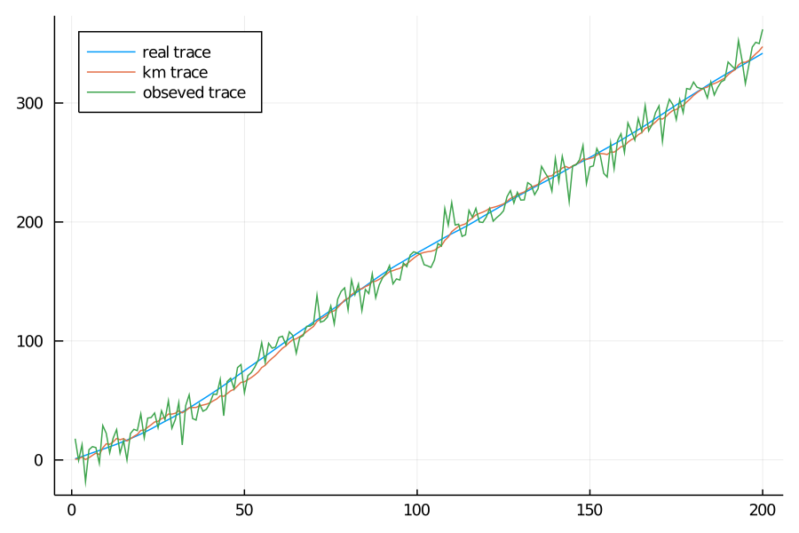

# EasyCode

Something tiny and funny！

## Classic Kalman Filter

Now the KalmanFilter.jl just include the Classic Kalman Filter, so it is limited. 

All symbols are the same of   [wikipedia](https://en.wikipedia.org/wiki/Kalman_filter), so it is easy to contrast wiki when scanning the code.

let's see how it works.

### Initialize the model

```julia
using StatsBase
using Plots
using Distributions
include("KalmanFilter.jl")
const kf = KalmanFilter

x_0 = [0.0, 1.0]
P_0 = [0.6 0.0; 0.0 1.0]
F = [1.0 1.0; 0.0 1.0]
Q = 0.25 .* [0.0025 0.005; 0.005 0.01]
H = [1.0 0.0]
R = ones(1, 1) * 100.0

move = kf.Movement(F, Q)
obsv = kf.Observation(H, R)
interior = kf.Interior(2, 1)

```

### generating data

```julia
xprocess = x_0
xnew = x_0
for i in 1:200
    xnew = F*xnew + [0.5, 1.0]*rand(Normal(0.0, 0.05))
    xprocess = hcat(xprocess, xnew)
end
processlist = xprocess[1, 2:end]
randomnoise = rand(Normal(0, 10), 200)
recordlist = processlist + randomnoise
recordlist = reshape(recordlist, 1, length(recordlist))
```

### check dimension

```julia
kf.check_kalman(x, P, recordlist[:, 1], interior, move, obsv)
```

### trace the observing data

```julia
x_update, P_update = x_0, P_0
xlist = x
Klist = [0.0; 0.0]
for i in 1:size(recordlist)[2]
    x_predict, P_predict = kf.predict_kalman(x_update, P_update, move)
    x_update, P_update = kf.update_kalman!(x_predict, P_predict, recordlist[:, i], obsv, interior)
    xlist = hcat(xlist, x_update)
    Klist = hcat(Klist, interior.K)
end
```

### data visualization

```julia
p2 = plot(processlist, label = "real trace")
plot!(p2, xlist[1, 2:end], label = "km trace")
plot!(p2, recordlist[1, :], label = "obseved trace", legend = :topleft, dpi = 150)

p3 = plot(xlist[2, 2:end], label = "km velocity")
plot!(p3, xprocess[2, 2:end], label = "real velocity", dpi = 150)

p1 = plot(processlist .- xlist[1, 2:end])
plot!(p1, processlist .- recordlist[1, :], dpi = 150)

plot(p2, p3, p1, layout = (3, 1), dpi = 150, legend = false)
```



